# Finding Star Clusters in Gaia data with Pandas and Scikit-Learn


## Introduction

Young star clusters and stellar associations are important sites for understanding the stellar birth environment and stellar evolution. The Gaia mission will provide the 3D location and proper motions for over 1 billion stars, making it the perfect telescope to discover new star clusters and further characterize known clusters.

This activity uses a piece of the initial Gaia data release as input for a machine learning clustering algorithm to identify stellar overdensities.


For this notebook, we're using [NumPy](http://www.numpy.org), [Matplotlib](https://matplotlib.org), [Pandas](http://pandas.pydata.org), [Scikit-learn](http://scikit-learn.org/stable/), and [Astropy](http://www.astropy.org). If you don't have these you can install them with [pip](https://packaging.python.org/installing/). On the commmand line type:
~~~~
pip install --upgrade numpy
pip install --upgrade astropy
pip install --upgrade scikit-learn
pip install --upgrade pandas
pip install --upgrade matplotlib
~~~~

## The Data
This dataset combines Hipparcos and Tycho-2 data with new Gaia observations to provide accurate 3D positions and proper motions on the sky -- no radial velocities yet, though!

All of the data can be downloaded in chunks from the Gaia website, [here](http://cdn.gea.esac.esa.int/Gaia/tgas_source/). A description of all of the columns can be found [here](https://gaia.esac.esa.int/documentation/GDR1/datamodel/Ch1/tgas_source.html).

I've taken the relevant columns and put everything into a Pandas DataFrame. This is compactly stored in the HDF5 data file, alldata.hdf, which you should download from [here](http://doi.org/10.5281/zenodo.569876) and place in this directory (note that the file is 285 MB).

Load the data by reading it in with Pandas,


```python
import pandas as pd
dat  = pd.read_hdf('alldata.hdf')
```

You can think of this simple Pandas DataFrame as a large table which has built in functions to process rows and columns, read and write to many different formats on disk, and interact with other DataFrames.

Try printing the DataFrame to see a small sample.


```python
print(dat)
```

                     source_id  ref_epoch          ra  ra_error       dec  \
    0            7627862074752     2015.0   45.034330  0.305989  0.235392   
    1            9277129363072     2015.0   45.165007  2.583882  0.200068   
    2           13297218905216     2015.0   45.086155  0.213836  0.248825   
    3           13469017597184     2015.0   45.066542  0.276039  0.248211   
    4           15736760328576     2015.0   45.136038  0.170697  0.335044   
    5           16527034310784     2015.0   45.141378  0.205008  0.359618   
    6           16733192740608     2015.0   45.152959  0.189524  0.386343   
    7           16870631694208     2015.0   45.112779  0.206981  0.380844   
    8           26834955821312     2015.0   45.010270  0.243576  0.351099   
    9           33260226885120     2015.0   44.974659  0.267911  0.473472   
    10          44358422235136     2015.0   45.501447  0.134010  0.497704   
    11          51745765982848     2015.0   45.467165  0.146028  0.655080   
    12          82463372227072     2015.0   44.866247  0.160620  0.561507   
    13          83150566993664     2015.0   44.937343  0.208963  0.623838   
    14          86105504493056     2015.0   44.797149  0.794706  0.630677   
    15          92599494964480     2015.0   44.414969  0.205710  0.567882   
    16         111600430360448     2015.0   44.918310  0.191469  0.755087   
    17         115723598973952     2015.0   45.105609  0.168169  0.812344   
    18         120190364960512     2015.0   45.008011  0.170795  0.888580   
    19         122732985598464     2015.0   45.196000  0.213285  0.993305   
    20         132662949987200     2015.0   45.072787  0.213813  0.969997   
    21         134999412195456     2015.0   45.118602  0.324832  1.046581   
    22         139363098967552     2015.0   45.025729  0.219474  1.110209   
    23         142730353190144     2015.0   45.667584  0.156331  0.712084   
    24         148949465832832     2015.0   45.656687  0.250327  0.848682   
    25         180045029052928     2015.0   46.123388  0.151871  1.066354   
    26         189871914442624     2015.0   46.191486  0.159092  1.190304   
    27         202619377158912     2015.0   46.044931  0.212695  1.230477   
    28         219558728443008     2015.0   45.356442  0.365251  1.156174   
    29         223407019139328     2015.0   45.580692  0.376271  1.194216   
    ...                    ...        ...         ...       ...       ...   
    34045  6917296790170220032     2015.0  314.765232  0.363478 -1.194010   
    34046  6917297683523416064     2015.0  314.735773  0.440119 -1.171667   
    34047  6917321597900574720     2015.0  313.972540  0.156991 -1.338388   
    34048  6917329603720362112     2015.0  314.274696  0.251578 -1.198183   
    34049  6917333933046642944     2015.0  314.155273  0.348785 -1.144750   
    34050  6917335410515389696     2015.0  314.141918  0.209730 -1.063458   
    34051  6917339842921641984     2015.0  313.842549  0.206049 -1.140866   
    34052  6917342557341568384     2015.0  313.778438  0.450388 -1.134689   
    34053  6917350322641840128     2015.0  313.814036  0.222999 -1.020702   
    34054  6917355270444915200     2015.0  314.297637  0.383452 -1.046371   
    34055  6917371831838057728     2015.0  314.078916  0.381021 -0.989514   
    34056  6917375955006659200     2015.0  314.068253  0.445682 -0.900887   
    34057  6917383239271187712     2015.0  314.351767  0.646789 -0.726464   
    34058  6917389252225936128     2015.0  315.046298  1.192695 -1.112642   
    34059  6917402171487559808     2015.0  315.149614  0.284295 -0.899310   
    34060  6917406638253525760     2015.0  314.878231  0.225291 -0.966348   
    34061  6917412960445383040     2015.0  314.818544  0.286806 -0.839533   
    34062  6917413510201195904     2015.0  314.858023  0.183427 -0.804869   
    34063  6917420519587820928     2015.0  314.836804  0.224744 -0.754084   
    34064  6917428319248453760     2015.0  315.270266  0.312305 -0.768764   
    34065  6917452439784507648     2015.0  315.410962  0.665954 -0.478297   
    34066  6917474670535481728     2015.0  314.853264  0.202654 -0.539717   
    34067  6917476319802433536     2015.0  314.459750  0.968369 -0.724208   
    34068  6917487486717891328     2015.0  314.766314  0.301253 -0.473161   
    34069  6917487967754227584     2015.0  314.812092  0.305573 -0.439632   
    34070  6917488998546378368     2015.0  314.741700  0.277332 -0.423197   
    34071  6917493705830041600     2015.0  314.643818  0.359097 -0.324975   
    34072  6917504975824469248     2015.0  315.282880  0.472265 -0.343177   
    34073  6917517998165066624     2015.0  314.740648  0.192053 -0.228114   
    34074  6917521537218608640     2015.0  314.960731  0.491821 -0.221301   

           dec_error   parallax  parallax_error        pmra  pmra_error  \
    0       0.218802   6.352951        0.307910   43.752313    0.070542   
    1       1.197789   3.900329        0.323488   10.036263    4.611414   
    2       0.180326   3.155313        0.273484    2.932284    1.908644   
    3       0.200958   2.292367        0.280972    3.661982    2.065052   
    4       0.170130   1.582077        0.261539    0.340802    1.220476   
    5       0.179848   8.663080        0.255867  -52.849281    1.264286   
    6       0.171880   5.698205        0.263677   24.527237    1.177377   
    7       0.150943   2.090812        0.222206   -1.572928    1.733194   
    8       0.169345   6.202492        0.247253   26.308009    2.034845   
    9       0.163531   1.677673        0.222067    9.104210    2.209395   
    10      0.395606   9.957504        0.547771   25.103704    0.081780   
    11      0.151794   5.032630        0.230189   97.761970    1.199557   
    12      0.151276   2.458658        0.218785   -6.289263    1.458177   
    13      0.157091  15.728640        0.229521  -98.248124    0.181544   
    14      0.485048   4.695800        0.956438    9.533592    1.084953   
    15      0.168425  11.253095        0.267342  123.868785    1.319942   
    16      0.181781   2.785788        0.268922   29.299627    1.470242   
    17      0.157115  10.549845        0.231620    7.810436    1.564040   
    18      0.164587   4.198517        0.250279  -59.555191    1.192541   
    19      0.206712   6.581782        0.303335   16.400616    0.801764   
    20      0.165124   5.746190        0.251024   29.368910    0.084182   
    21      0.235454   1.186701        0.301492    1.118005    2.366421   
    22      0.215515   2.081689        0.313718  -14.473087    1.497436   
    23      0.155345   5.400538        0.245903   80.425517    1.341393   
    24      0.211829   1.512226        0.332788   -5.676397    0.124096   
    25      0.532063   2.986565        0.776729   -5.716453    1.057208   
    26      0.571938   0.656160        0.845735    5.476655    1.390180   
    27      0.629442   2.872148        0.906019    2.199605    1.413306   
    28      0.351513   4.740228        0.522721   17.693950    0.050109   
    29      0.157121   0.846912        0.405900    5.308157    7.278217   
    ...          ...        ...             ...         ...         ...   
    34045   0.212978   3.050534        0.741126   18.620553    2.685246   
    34046   0.238175   1.496255        0.888100   27.513501    3.228359   
    34047   0.123209   2.869659        0.281346   18.935067    0.932710   
    34048   0.608068   2.031372        0.599195  -15.402302    0.948013   
    34049   0.337395   8.599250        0.526418  -22.592537    1.497488   
    34050   0.201801   3.199663        0.228593   -4.313455    0.076549   
    34051   0.160198   3.089541        0.411665   -0.877548    1.423813   
    34052   0.213632  -0.052200        0.944066   15.213932    3.458697   
    34053   0.139983   1.414788        0.459721  -14.390107    1.650502   
    34054   0.173235   1.441584        0.777750   -2.023907    2.858043   
    34055   0.224392   3.054000        0.724973   10.703563    2.580172   
    34056   0.437163   5.024796        0.675503    2.588341    1.231998   
    34057   0.404334   8.092877        0.477413   41.053654    1.120982   
    34058   0.770643   0.888197        0.932313    3.450822    2.165659   
    34059   0.149646   3.290275        0.563243   -7.657043    2.042954   
    34060   0.160218   1.611850        0.458997    2.983173    1.639595   
    34061   0.257089   0.445328        0.427754    0.736633    1.301267   
    34062   0.179483   3.078234        0.335764   -2.737049    1.098831   
    34063   0.204943   3.427077        0.399098    2.650628    1.313554   
    34064   0.190012   3.169772        0.302901    0.088162    0.075149   
    34065   0.389449  23.499923        0.516988  159.970016    0.147853   
    34066   0.176745   6.082151        0.276084   10.011422    0.756730   
    34067   0.589946  13.715043        0.691190    4.837336    1.766099   
    34068   0.167501   7.962663        0.588791   21.825678    2.106624   
    34069   0.295601   0.785996        0.446457   -5.483699    0.893791   
    34070   0.249741   5.074307        0.284089   21.970773    0.078469   
    34071   0.148234   1.698348        0.741014   -1.283561    2.741681   
    34072   0.209030   6.036938        0.396880   15.713556    0.941184   
    34073   0.131650   1.484142        0.348601   11.352889    1.219847   
    34074   0.268675   2.680111        0.450774    2.897879    1.035482   

                pmdec  pmdec_error  phot_g_mean_mag           l          b  \
    0       -7.641990     0.087402         7.991378  176.740413 -48.714422   
    1      -55.109173     2.522929        10.580959  176.916420 -48.645004   
    2       -1.602867     1.035259        10.743102  176.780400 -48.667845   
    3      -18.414912     1.129851        11.075682  176.760412 -48.682365   
    4       -2.379387     0.710632        10.168701  176.739184 -48.572035   
    5      -72.711396     0.720852         9.971989  176.718131 -48.551099   
    6       -3.350355     0.707184         9.873996  176.701325 -48.524183   
    7      -11.661616     0.982994        10.561042  176.665032 -48.556851   
    8        9.195405     1.028325         9.970699  176.589274 -48.651100   
    9      -24.526435     1.131898         9.790358  176.419105 -48.591185   
    10     -23.671980     0.077636         9.317437  176.945298 -48.196220   
    11     -20.939852     0.623911        11.259156  176.739930 -48.111535   
    12     -12.475993     0.810281        10.555697  176.209299 -48.607023   
    13    -160.800170     0.167036         9.482735  176.217377 -48.512626   
    14     -50.587002     2.401721        10.276479  176.061442 -48.607747   
    15      66.745085     0.738076         9.854890  175.721092 -48.923440   
    16     -29.862607     0.844261        11.263437  176.056139 -48.434129   
    17     -82.990462     0.908631        10.787842  176.192429 -48.260497   
    18     -64.632961     0.649234         9.215294  176.007954 -48.276522   
    19     -24.100299     0.538782         8.774116  176.094063 -48.069158   
    20     -93.858217     0.082084         7.385724  175.989318 -48.173229   
    21       4.687236     1.275574        11.914900  175.955948 -48.086815   
    22      -0.216158     0.832325        11.533558  175.790413 -48.107992   
    23      12.644391     0.736791        11.319064  176.886896 -47.927829   
    24       0.735340     0.100249         9.713120  176.729163 -47.840718   
    25       4.547636     0.595603        10.231507  176.977602 -47.353826   
    26     -28.331014     0.779932        11.557126  176.915611 -47.218804   
    27     -22.447649     0.825536        11.091142  176.723034 -47.296261   
    28      -1.378007     0.048145         7.342878  176.088911 -47.840582   
    29      -5.454302     2.371843        11.405336  176.282250 -47.653997   
    ...           ...          ...              ...         ...        ...   
    34045   -7.079728     1.432224        10.561375   47.615439 -28.670988   
    34046   -6.010818     1.717241        11.167043   47.620299 -28.634266   
    34047    3.312674     0.601500         9.536238   47.017862 -28.060733   
    34048  -25.618008     1.230587         9.024313   47.328258 -28.250516   
    34049  -57.688259     1.209436         9.999796   47.311921 -28.120502   
    34050    1.020499     0.049310         7.649970   47.383697 -28.067801   
    34051   -7.093075     0.827746         9.743663   47.136610 -27.848831   
    34052   -7.058379     1.799592        10.925318   47.106022 -27.790394   
    34053  -40.097915     0.896231         9.885277   47.237516 -27.763475   
    34054   -8.061882     1.484723        10.765187   47.489957 -28.193303   
    34055  -14.718697     1.455904        11.237844   47.419708 -27.976012   
    34056   10.973142     1.711955         9.977519   47.500032 -27.921847   
    34057  -54.221917     1.510662         9.524471   47.833480 -28.077103   
    34058    5.184958     2.950987         9.767707   47.858589 -28.871391   
    34059   -9.955667     1.103737        10.744613   48.128243 -28.851157   
    34060   -5.810293     0.896728         9.837787   47.904294 -28.652225   
    34061  -13.248180     0.999058         8.940431   47.993742 -28.536141   
    34062  -23.098967     0.711390         9.683264   48.050631 -28.552341   
    34063  -13.938733     0.864367         9.699898   48.087940 -28.508127   
    34064   12.743394     0.043069         8.065196   48.326862 -28.887799   
    34065 -133.586663     0.087725        10.029232   48.693943 -28.858900   
    34066  -18.307018     0.678115         9.000583   48.306903 -28.412379   
    34067  -61.993429     2.238018         9.838596   47.898156 -28.168809   
    34068  -40.087701     1.181743        10.418828   48.321079 -28.303596   
    34069   11.000701     1.127911         8.263434   48.380466 -28.325648   
    34070   -4.440524     0.047433         8.988852   48.355406 -28.256816   
    34071  -10.401225     1.401695        10.324625   48.393942 -28.122375   
    34072  -27.852345     1.277858         9.238852   48.750523 -28.679451   
    34073    1.847108     0.730717         9.017069   48.544630 -28.155566   
    34074    3.151734     1.438891         9.732571   48.680054 -28.340635   

              ecl_lon    ecl_lat  
    0       42.641825 -16.121052  
    1       42.761180 -16.193033  
    2       42.697502 -16.123363  
    3       42.677791 -16.118216  
    4       42.773370 -16.055481  
    5       42.786150 -16.033536  
    6       42.805789 -16.011356  
    7       42.764140 -16.004886  
    8       42.653112 -16.003369  
    9       42.654932 -15.875932  
    10      43.186350 -16.006199  
    11      43.199697 -15.845644  
    12      42.573980 -15.760018  
    13      42.663563 -15.721228  
    14      42.526411 -15.673636  
    15      42.127916 -15.621262  
    16      42.684529 -15.590152  
    17      42.887847 -15.590066  
    18      42.814039 -15.488683  
    19      43.032261 -15.443258  
    20      42.902952 -15.429693  
    21      42.971542 -15.369771  
    22      42.898652 -15.281855  
    23      43.416253 -15.849093  
    24      43.446421 -15.715171  
    25      43.975631 -15.640883  
    26      44.080175 -15.541588  
    27      43.946408 -15.461170  
    28      43.240515 -15.333975  
    29      43.474482 -15.362416  
    ...           ...        ...  
    34045  316.868830  15.262468  
    34046  316.846337  15.292399  
    34047  316.038920  15.352768  
    34048  316.380781  15.400302  
    34049  316.278103  15.485835  
    34050  316.289092  15.567534  
    34051  315.968378  15.579224  
    34052  315.906442  15.603468  
    34053  315.975706  15.702522  
    34054  316.448964  15.539064  
    34055  316.248519  15.656465  
    34056  316.264372  15.744417  
    34057  316.598712  15.829726  
    34058  317.172047  15.258519  
    34059  317.339125  15.432362  
    34060  317.049577  15.447441  
    34061  317.028640  15.586138  
    34062  317.078328  15.607805  
    34063  317.072613  15.662567  
    34064  317.498492  15.521843  
    34065  317.726766  15.758154  
    34066  317.153895  15.862830  
    34067  316.706814  15.800650  
    34068  317.087587  15.951840  
    34069  317.143296  15.970571  
    34070  317.078236  16.006807  
    34071  317.010546  16.129270  
    34072  317.640833  15.924969  
    34073  317.136362  16.193729  
    34074  317.357581  16.135962  

    [2057050 rows x 17 columns]


We see that we have 2,057,050 stars in our dataset, each of which has a measured position on the sky (both (ra,dec) and (l,b)), a parallax, a G band magnitude, and proper motion on the sky (pmra,pmdec). Each of these measurements also has an error associated with it.

We can see how much memory our DataFrame object is taking up with,


```python
print('{:d} rows'.format(len(dat)))
print('{:.1f} MB'.format(dat.memory_usage(index=True,deep=True).sum()/1e6))
```

    2057050 rows
    296.2 MB


We can try reducing this by only loading in the columns we'll be working with.


```python
dat  = pd.read_hdf('alldata.hdf',columns=['ra','ra_error','dec','dec_error','parallax','parallax_error'])
print('{:d} rows'.format(len(dat)))
print('{:.1f} MB'.format(dat.memory_usage(index=True,deep=True).sum()/1e6))
print(dat)
```

    2057050 rows
    115.2 MB
                   ra  ra_error       dec  dec_error   parallax  parallax_error
    0       45.034330  0.305989  0.235392   0.218802   6.352951        0.307910
    1       45.165007  2.583882  0.200068   1.197789   3.900329        0.323488
    2       45.086155  0.213836  0.248825   0.180326   3.155313        0.273484
    3       45.066542  0.276039  0.248211   0.200958   2.292367        0.280972
    4       45.136038  0.170697  0.335044   0.170130   1.582077        0.261539
    5       45.141378  0.205008  0.359618   0.179848   8.663080        0.255867
    6       45.152959  0.189524  0.386343   0.171880   5.698205        0.263677
    7       45.112779  0.206981  0.380844   0.150943   2.090812        0.222206
    8       45.010270  0.243576  0.351099   0.169345   6.202492        0.247253
    9       44.974659  0.267911  0.473472   0.163531   1.677673        0.222067
    10      45.501447  0.134010  0.497704   0.395606   9.957504        0.547771
    11      45.467165  0.146028  0.655080   0.151794   5.032630        0.230189
    12      44.866247  0.160620  0.561507   0.151276   2.458658        0.218785
    13      44.937343  0.208963  0.623838   0.157091  15.728640        0.229521
    14      44.797149  0.794706  0.630677   0.485048   4.695800        0.956438
    15      44.414969  0.205710  0.567882   0.168425  11.253095        0.267342
    16      44.918310  0.191469  0.755087   0.181781   2.785788        0.268922
    17      45.105609  0.168169  0.812344   0.157115  10.549845        0.231620
    18      45.008011  0.170795  0.888580   0.164587   4.198517        0.250279
    19      45.196000  0.213285  0.993305   0.206712   6.581782        0.303335
    20      45.072787  0.213813  0.969997   0.165124   5.746190        0.251024
    21      45.118602  0.324832  1.046581   0.235454   1.186701        0.301492
    22      45.025729  0.219474  1.110209   0.215515   2.081689        0.313718
    23      45.667584  0.156331  0.712084   0.155345   5.400538        0.245903
    24      45.656687  0.250327  0.848682   0.211829   1.512226        0.332788
    25      46.123388  0.151871  1.066354   0.532063   2.986565        0.776729
    26      46.191486  0.159092  1.190304   0.571938   0.656160        0.845735
    27      46.044931  0.212695  1.230477   0.629442   2.872148        0.906019
    28      45.356442  0.365251  1.156174   0.351513   4.740228        0.522721
    29      45.580692  0.376271  1.194216   0.157121   0.846912        0.405900
    ...           ...       ...       ...        ...        ...             ...
    34045  314.765232  0.363478 -1.194010   0.212978   3.050534        0.741126
    34046  314.735773  0.440119 -1.171667   0.238175   1.496255        0.888100
    34047  313.972540  0.156991 -1.338388   0.123209   2.869659        0.281346
    34048  314.274696  0.251578 -1.198183   0.608068   2.031372        0.599195
    34049  314.155273  0.348785 -1.144750   0.337395   8.599250        0.526418
    34050  314.141918  0.209730 -1.063458   0.201801   3.199663        0.228593
    34051  313.842549  0.206049 -1.140866   0.160198   3.089541        0.411665
    34052  313.778438  0.450388 -1.134689   0.213632  -0.052200        0.944066
    34053  313.814036  0.222999 -1.020702   0.139983   1.414788        0.459721
    34054  314.297637  0.383452 -1.046371   0.173235   1.441584        0.777750
    34055  314.078916  0.381021 -0.989514   0.224392   3.054000        0.724973
    34056  314.068253  0.445682 -0.900887   0.437163   5.024796        0.675503
    34057  314.351767  0.646789 -0.726464   0.404334   8.092877        0.477413
    34058  315.046298  1.192695 -1.112642   0.770643   0.888197        0.932313
    34059  315.149614  0.284295 -0.899310   0.149646   3.290275        0.563243
    34060  314.878231  0.225291 -0.966348   0.160218   1.611850        0.458997
    34061  314.818544  0.286806 -0.839533   0.257089   0.445328        0.427754
    34062  314.858023  0.183427 -0.804869   0.179483   3.078234        0.335764
    34063  314.836804  0.224744 -0.754084   0.204943   3.427077        0.399098
    34064  315.270266  0.312305 -0.768764   0.190012   3.169772        0.302901
    34065  315.410962  0.665954 -0.478297   0.389449  23.499923        0.516988
    34066  314.853264  0.202654 -0.539717   0.176745   6.082151        0.276084
    34067  314.459750  0.968369 -0.724208   0.589946  13.715043        0.691190
    34068  314.766314  0.301253 -0.473161   0.167501   7.962663        0.588791
    34069  314.812092  0.305573 -0.439632   0.295601   0.785996        0.446457
    34070  314.741700  0.277332 -0.423197   0.249741   5.074307        0.284089
    34071  314.643818  0.359097 -0.324975   0.148234   1.698348        0.741014
    34072  315.282880  0.472265 -0.343177   0.209030   6.036938        0.396880
    34073  314.740648  0.192053 -0.228114   0.131650   1.484142        0.348601
    34074  314.960731  0.491821 -0.221301   0.268675   2.680111        0.450774

    [2057050 rows x 6 columns]


We cut the size of our DataFrame in half!

### Pandas indexing

One thing that makes pandas great for analyzing large datasets is the way it stores the data. Rather than using a normal list or numpy array, pandas uses a hashtable to quickly find a particular row of the data. We can see the keys for this hashtable as the row numbers when we print our pandas DataFrame object.

We can see all of these indices for our DataFrame by accessing the index attribute of the DataFrame,


```python
print(dat.index)
```

    Int64Index([    0,     1,     2,     3,     4,     5,     6,     7,     8,
                    9,
                ...
                34065, 34066, 34067, 34068, 34069, 34070, 34071, 34072, 34073,
                34074],
               dtype='int64', length=2057050)


So pandas uses a list of integers to label the rows of our data. We can get a little more information by sorting this list before printing it,


```python
import numpy as np
print(np.sort(dat.index))
```

    [     0      0      0 ..., 134864 134864 134864]


Hold on, something doesn't look quite right. We have duplicate indices for different rows of our data! This is one thing we have to careful about when we feed pandas a large dataset -- the hashtable may have non-unique keys.

Luckily, we can fix this by simply recalculating the indices after we load our data,


```python
dat  = pd.read_hdf('alldata.hdf',columns=['ra','ra_error','dec','dec_error','parallax','parallax_error'])
dat = dat.reset_index()
dat.index
```


    RangeIndex(start=0, stop=2057050, step=1)


It looks like we have unique indices now!

Now we can move on to visualizing our data.

### Visualizing our data
The DataFrame object contains some built-in convienence functions for quickly getting a sense of your data. For example, we can quickly make histograms of different columns with the dat.hist() method,


```python
import matplotlib.pyplot as plt
%matplotlib inline
fig,axes = plt.subplots(1,3,figsize=(17,3))
dat.hist(['ra','dec','parallax'],ax=axes,xlabelsize=15,ylabelsize=15,bins=50);
```


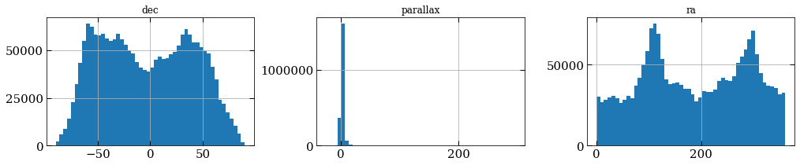


We can see right away that Gaia is an all sky survey as it covers the full range of right ascension and declination. The parallax histogram looks a little funny though. There seems to be some bad parallax data that we should remove before proceeding. Remember that parallax is related to distance via

$$\text{distance in pc} = 1 / (\text{parallax in arcsec}) .$$

The Gaia parallaxes are reported in milliarcsec, and so the distances will be in kpc. From looking at the histogram for parallax we see two problems. The first is there are a number of negative parallaxes. We can verify this by slicing our DataFrame object to only show the rows where the parallax is negative,


```python
print(dat[dat.parallax<0])
```

             index          ra  ra_error        dec  dec_error  parallax  \
    783        783   45.515296  0.141345   5.989946   0.346414 -0.012890   
    810        810   44.974303  0.520221   6.200443   0.414850 -0.014806   
    1031      1031   51.650489  0.814994   5.706888   0.612814 -1.407067   
    1245      1245   51.340087  0.691294   8.748267   0.362725 -0.298734   
    2443      2443   37.129398  0.831394  10.069239   0.399300 -0.133778   
    3822      3822   46.991066  0.629890  16.730952   0.225115 -0.224989   
    3897      3897   43.298678  0.480449  16.169881   0.374759 -0.111915   
    4086      4086   56.877414  1.169436  11.461870   0.508449 -0.572870   
    4191      4191   55.527342  0.449842  11.467865   0.161759 -0.261065   
    4530      4530   56.914127  0.668079  14.841630   0.171766 -2.472477   
    4988      4988   55.946968  0.942106  16.561471   0.226408 -0.291551   
    5100      5100   54.796546  0.780839  16.734744   0.398559 -0.532618   
    5270      5270   55.769354  0.439302  19.020534   0.217892 -0.325832   
    5632      5632   65.286445  1.140493  19.601063   0.749313 -0.255108   
    7086      7086   54.880870  0.869912  19.685986   0.315988 -0.152013   
    7334      7334   48.250066  0.791378  18.115850   0.307591 -0.159963   
    7482      7482   49.470113  0.764500  19.761699   0.258826 -0.052431   
    7829      7829   52.194308  1.188875  22.436005   0.152018 -1.705954   
    8084      8084   55.344026  3.121221  20.988876   1.416083 -0.643785   
    8443      8443   56.009051  3.420429  23.599998   1.569564 -0.481137   
    8538      8538   59.577674  1.184833  23.312322   0.180246 -0.564561   
    9387      9387   51.886178  0.515588  25.332011   0.479561 -0.039135   
    9542      9542   56.062806  0.776669  25.073097   0.163101 -0.332213   
    9880      9880   55.019239  0.725582  26.315274   0.122226 -1.021263   
    9934      9934   55.912590  0.852220  27.114028   0.157410 -0.190852   
    10041    10041   56.636902  0.296163  27.668668   0.293690 -0.349588   
    10115    10115   55.745582  0.312157  28.210019   0.204863 -0.262956   
    10179    10179   56.106752  0.909904  29.496826   0.148312 -1.378886   
    10377    10377   32.710331  0.525565  12.526121   0.394918 -0.804147   
    11359    11359   33.459140  2.648608  18.039652   0.832688 -0.381682   
    ...        ...         ...       ...        ...        ...       ...   
    2056423  33448  311.248518  0.398961  -6.117082   0.187211 -0.672482   
    2056433  33458  311.598598  0.439350  -5.616935   0.208287 -0.155961   
    2056452  33477  312.064301  0.242140  -5.430808   0.149086 -0.269706   
    2056464  33489  313.668019  0.412905  -5.583705   0.188313 -0.048324   
    2056484  33509  314.589281  0.425653  -4.863244   0.176742 -0.055059   
    2056499  33524  313.336793  0.434973  -4.755779   0.189681 -0.347159   
    2056521  33546  313.344539  0.350363  -3.974262   0.177033 -0.573623   
    2056535  33560  311.056699  0.381851  -5.659757   0.191707 -0.240922   
    2056548  33573  311.424679  0.418652  -5.259474   0.177835 -0.789527   
    2056579  33604  309.973201  0.497932  -5.019053   0.262649 -2.044536   
    2056595  33620  309.810772  0.372961  -4.650966   0.161991 -1.649397   
    2056599  33624  310.035346  0.435446  -4.345697   0.183701 -0.327885   
    2056650  33675  313.086805  0.338832  -3.911582   0.242674 -0.019779   
    2056681  33706  311.913629  0.373363  -3.557187   0.192121 -0.255225   
    2056691  33716  311.001961  0.468283  -3.685968   0.405888 -0.032160   
    2056701  33726  311.239858  0.529183  -3.298700   0.413599 -0.582164   
    2056705  33730  311.390080  0.384640  -3.148623   0.329609 -0.928917   
    2056714  33739  312.391935  0.356388  -3.165960   0.235713 -0.227645   
    2056722  33747  312.564209  0.378476  -3.115382   0.301502 -0.184599   
    2056739  33764  312.421300  0.229743  -2.695243   0.178499 -0.001552   
    2056760  33785  315.346678  0.508684  -3.933339   0.265979 -0.316290   
    2056775  33800  314.851546  0.473330  -3.787378   0.338367 -1.053046   
    2056779  33804  315.720378  0.451577  -3.918519   0.269825 -0.123523   
    2056796  33821  315.389806  0.385371  -3.517012   0.194703 -1.540204   
    2056831  33856  314.920480  0.359593  -3.260620   0.147800 -1.791382   
    2056883  33908  315.817813  0.649911  -2.574199   0.308736 -0.148027   
    2056952  33977  313.021008  0.472255  -2.582160   0.219522 -0.510647   
    2056963  33988  312.370100  0.474772  -2.499009   0.257280 -1.169252   
    2057002  34027  314.913688  0.475829  -1.321923   0.203663 -1.614503   
    2057027  34052  313.778438  0.450388  -1.134689   0.213632 -0.052200   

             parallax_error  
    783            0.538805  
    810            0.586321  
    1031           0.948178  
    1245           0.878693  
    2443           0.893831  
    3822           0.503557  
    3897           0.612425  
    4086           0.875119  
    4191           0.412225  
    4530           0.537089  
    4988           0.805282  
    5100           0.878620  
    5270           0.376044  
    5632           0.894750  
    7086           0.726433  
    7334           0.891198  
    7482           0.854152  
    7829           0.886046  
    8084           0.888988  
    8443           0.540520  
    8538           0.948216  
    9387           0.851018  
    9542           0.571965  
    9880           0.622645  
    9934           0.785840  
    10041          0.901389  
    10115          0.519180  
    10179          0.739238  
    10377          0.661857  
    11359          0.573779  
    ...                 ...  
    2056423        0.810346  
    2056433        0.938573  
    2056452        0.465799  
    2056464        0.873866  
    2056484        0.694494  
    2056499        0.921673  
    2056521        0.726616  
    2056535        0.817068  
    2056548        0.884565  
    2056579        0.999294  
    2056595        0.801551  
    2056599        0.933150  
    2056650        0.603673  
    2056681        0.529171  
    2056691        0.891996  
    2056701        0.835858  
    2056705        0.634763  
    2056714        0.704435  
    2056722        0.718506  
    2056739        0.263805  
    2056760        0.970300  
    2056775        0.870059  
    2056779        0.915759  
    2056796        0.790938  
    2056831        0.760018  
    2056883        0.994737  
    2056952        0.960010  
    2056963        0.983299  
    2057002        0.986499  
    2057027        0.944066  

    [30840 rows x 7 columns]


We can remove these by using the dat.drop() method,


```python
dat = dat.drop(dat[dat.parallax < 0].index)
print('{:d} rows'.format(len(dat)))
print('{:.1f} MB'.format(dat.memory_usage(index=True,deep=True).sum()/1e6))
fig,axes = plt.subplots(1,3,figsize=(17,3))
dat.hist(['ra','dec','parallax'],ax=axes,xlabelsize=15,ylabelsize=15,bins=50);
```

    2026210 rows
    129.7 MB


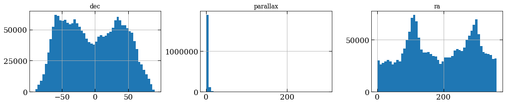


Looks better.

Note that if we forgot to reset our DataFrame indices with dat.reset_index() earlier, then calling the dat.drop() method would have removed all of the duplicate rows that shared an index with one of the negative parallax entries!

Next, we have a few parallaxes which are relatively large and are skewing our histogram. We can verify this by sorting our rows by descending parallax,


```python
dat.sort_values('parallax',ascending=False)
```


<div>
<table border="1" class="dataframe">
  <thead>
    <tr style="text-align: right;">
      <th></th>
      <th>index</th>
      <th>ra</th>
      <th>ra_error</th>
      <th>dec</th>
      <th>dec_error</th>
      <th>parallax</th>
      <th>parallax_error</th>
    </tr>
  </thead>
  <tbody>
    <tr>
      <th>1035691</th>
      <td>91636</td>
      <td>176.937519</td>
      <td>0.462309</td>
      <td>0.799460</td>
      <td>0.281370</td>
      <td>295.803638</td>
      <td>0.535664</td>
    </tr>
    <tr>
      <th>636544</th>
      <td>97084</td>
      <td>280.683855</td>
      <td>0.920717</td>
      <td>59.634628</td>
      <td>0.292361</td>
      <td>286.391028</td>
      <td>0.832375</td>
    </tr>
    <tr>
      <th>636545</th>
      <td>97085</td>
      <td>280.683792</td>
      <td>0.389218</td>
      <td>59.637860</td>
      <td>0.301627</td>
      <td>283.536922</td>
      <td>0.407929</td>
    </tr>
    <tr>
      <th>94182</th>
      <td>94182</td>
      <td>4.612109</td>
      <td>0.287586</td>
      <td>44.024673</td>
      <td>0.367812</td>
      <td>280.740075</td>
      <td>0.305500</td>
    </tr>
    <tr>
      <th>1976175</th>
      <td>88065</td>
      <td>319.296181</td>
      <td>0.368213</td>
      <td>-38.872138</td>
      <td>0.370400</td>
      <td>251.138192</td>
      <td>0.568683</td>
    </tr>
    <tr>
      <th>1157706</th>
      <td>78786</td>
      <td>247.574841</td>
      <td>0.420255</td>
      <td>-12.667522</td>
      <td>0.251275</td>
      <td>232.285621</td>
      <td>0.487817</td>
    </tr>
    <tr>
      <th>377161</th>
      <td>107431</td>
      <td>264.104293</td>
      <td>0.445606</td>
      <td>68.333850</td>
      <td>0.405466</td>
      <td>220.024758</td>
      <td>0.393103</td>
    </tr>
    <tr>
      <th>1431397</th>
      <td>82747</td>
      <td>176.454907</td>
      <td>0.178622</td>
      <td>-64.842957</td>
      <td>0.222308</td>
      <td>215.782333</td>
      <td>0.272784</td>
    </tr>
    <tr>
      <th>733609</th>
      <td>59284</td>
      <td>343.323837</td>
      <td>0.881040</td>
      <td>-14.266502</td>
      <td>0.789781</td>
      <td>214.051333</td>
      <td>0.970971</td>
    </tr>
    <tr>
      <th>1972089</th>
      <td>83979</td>
      <td>323.391271</td>
      <td>0.234962</td>
      <td>-49.012404</td>
      <td>0.297190</td>
      <td>201.118291</td>
      <td>0.511675</td>
    </tr>
    <tr>
      <th>288435</th>
      <td>18705</td>
      <td>176.938348</td>
      <td>0.395537</td>
      <td>78.693164</td>
      <td>0.325769</td>
      <td>191.392475</td>
      <td>0.388188</td>
    </tr>
    <tr>
      <th>139634</th>
      <td>4769</td>
      <td>67.808490</td>
      <td>0.633925</td>
      <td>58.968549</td>
      <td>0.474917</td>
      <td>181.504752</td>
      <td>0.622370</td>
    </tr>
    <tr>
      <th>240557</th>
      <td>105692</td>
      <td>103.700371</td>
      <td>0.582028</td>
      <td>33.266518</td>
      <td>0.694975</td>
      <td>180.318422</td>
      <td>0.836667</td>
    </tr>
    <tr>
      <th>920809</th>
      <td>111619</td>
      <td>82.867329</td>
      <td>0.616180</td>
      <td>-3.685946</td>
      <td>0.467683</td>
      <td>177.082573</td>
      <td>0.984590</td>
    </tr>
    <tr>
      <th>686004</th>
      <td>11679</td>
      <td>293.097120</td>
      <td>0.693566</td>
      <td>69.653934</td>
      <td>0.976061</td>
      <td>173.600696</td>
      <td>0.910296</td>
    </tr>
    <tr>
      <th>802636</th>
      <td>128311</td>
      <td>92.643620</td>
      <td>0.094764</td>
      <td>-21.867624</td>
      <td>0.203850</td>
      <td>172.661342</td>
      <td>0.291133</td>
    </tr>
    <tr>
      <th>1139027</th>
      <td>60107</td>
      <td>289.227813</td>
      <td>0.254156</td>
      <td>5.163346</td>
      <td>0.253736</td>
      <td>169.432737</td>
      <td>0.363420</td>
    </tr>
    <tr>
      <th>747797</th>
      <td>73472</td>
      <td>357.306328</td>
      <td>0.353555</td>
      <td>2.397187</td>
      <td>0.147146</td>
      <td>169.092433</td>
      <td>0.382738</td>
    </tr>
    <tr>
      <th>1823379</th>
      <td>70134</td>
      <td>233.047362</td>
      <td>0.395686</td>
      <td>-41.279888</td>
      <td>0.211157</td>
      <td>168.759088</td>
      <td>0.561607</td>
    </tr>
    <tr>
      <th>1996551</th>
      <td>108441</td>
      <td>303.477084</td>
      <td>0.299771</td>
      <td>-45.164686</td>
      <td>0.363286</td>
      <td>162.235088</td>
      <td>0.507104</td>
    </tr>
    <tr>
      <th>1918530</th>
      <td>30420</td>
      <td>218.568533</td>
      <td>0.555731</td>
      <td>-12.517089</td>
      <td>0.682684</td>
      <td>159.132195</td>
      <td>0.935274</td>
    </tr>
    <tr>
      <th>264258</th>
      <td>129393</td>
      <td>138.592033</td>
      <td>0.252283</td>
      <td>52.683613</td>
      <td>0.333815</td>
      <td>158.956745</td>
      <td>0.392579</td>
    </tr>
    <tr>
      <th>1918218</th>
      <td>30108</td>
      <td>229.856644</td>
      <td>0.306613</td>
      <td>-7.722680</td>
      <td>0.246396</td>
      <td>158.642895</td>
      <td>0.354875</td>
    </tr>
    <tr>
      <th>344539</th>
      <td>74809</td>
      <td>246.355682</td>
      <td>0.600227</td>
      <td>54.303386</td>
      <td>0.538926</td>
      <td>154.083141</td>
      <td>0.596926</td>
    </tr>
    <tr>
      <th>1158736</th>
      <td>79816</td>
      <td>253.851650</td>
      <td>0.265568</td>
      <td>-8.326327</td>
      <td>0.186491</td>
      <td>153.695396</td>
      <td>0.350193</td>
    </tr>
    <tr>
      <th>1343870</th>
      <td>130085</td>
      <td>45.462532</td>
      <td>0.952523</td>
      <td>-16.594458</td>
      <td>0.667242</td>
      <td>148.510255</td>
      <td>0.941835</td>
    </tr>
    <tr>
      <th>759622</th>
      <td>85297</td>
      <td>344.140522</td>
      <td>0.425399</td>
      <td>16.552248</td>
      <td>0.316028</td>
      <td>145.981548</td>
      <td>0.513801</td>
    </tr>
    <tr>
      <th>1042468</th>
      <td>98413</td>
      <td>162.713204</td>
      <td>0.792804</td>
      <td>6.804717</td>
      <td>0.593135</td>
      <td>143.553036</td>
      <td>0.971027</td>
    </tr>
    <tr>
      <th>657982</th>
      <td>118522</td>
      <td>313.332456</td>
      <td>0.251752</td>
      <td>62.151173</td>
      <td>0.386273</td>
      <td>142.165443</td>
      <td>0.310414</td>
    </tr>
    <tr>
      <th>1163473</th>
      <td>84553</td>
      <td>261.436049</td>
      <td>0.181358</td>
      <td>2.106487</td>
      <td>0.184051</td>
      <td>129.264809</td>
      <td>0.264233</td>
    </tr>
    <tr>
      <th>...</th>
      <td>...</td>
      <td>...</td>
      <td>...</td>
      <td>...</td>
      <td>...</td>
      <td>...</td>
      <td>...</td>
    </tr>
    <tr>
      <th>1378204</th>
      <td>29554</td>
      <td>159.261422</td>
      <td>0.195170</td>
      <td>-63.488568</td>
      <td>0.144476</td>
      <td>0.000344</td>
      <td>0.387339</td>
    </tr>
    <tr>
      <th>2052194</th>
      <td>29219</td>
      <td>315.726278</td>
      <td>0.411026</td>
      <td>-16.420915</td>
      <td>0.206001</td>
      <td>0.000337</td>
      <td>0.946564</td>
    </tr>
    <tr>
      <th>1911692</th>
      <td>23582</td>
      <td>220.897611</td>
      <td>0.701477</td>
      <td>-21.006408</td>
      <td>0.243206</td>
      <td>0.000327</td>
      <td>0.620934</td>
    </tr>
    <tr>
      <th>1846402</th>
      <td>93157</td>
      <td>195.215629</td>
      <td>0.230604</td>
      <td>-57.582006</td>
      <td>0.153829</td>
      <td>0.000307</td>
      <td>0.426777</td>
    </tr>
    <tr>
      <th>718206</th>
      <td>43881</td>
      <td>29.042201</td>
      <td>0.317048</td>
      <td>-11.264366</td>
      <td>0.220743</td>
      <td>0.000288</td>
      <td>0.423097</td>
    </tr>
    <tr>
      <th>1795871</th>
      <td>42626</td>
      <td>263.781774</td>
      <td>0.763716</td>
      <td>-48.763230</td>
      <td>0.575749</td>
      <td>0.000280</td>
      <td>0.341724</td>
    </tr>
    <tr>
      <th>1851295</th>
      <td>98050</td>
      <td>198.723578</td>
      <td>0.426686</td>
      <td>-54.935028</td>
      <td>0.640434</td>
      <td>0.000280</td>
      <td>0.717644</td>
    </tr>
    <tr>
      <th>946606</th>
      <td>2551</td>
      <td>91.283731</td>
      <td>1.018862</td>
      <td>9.754557</td>
      <td>1.125462</td>
      <td>0.000256</td>
      <td>0.862931</td>
    </tr>
    <tr>
      <th>1371232</th>
      <td>22582</td>
      <td>151.228626</td>
      <td>0.534664</td>
      <td>-71.036046</td>
      <td>0.440814</td>
      <td>0.000256</td>
      <td>0.671848</td>
    </tr>
    <tr>
      <th>525558</th>
      <td>120963</td>
      <td>356.100629</td>
      <td>0.500013</td>
      <td>57.333236</td>
      <td>0.328623</td>
      <td>0.000246</td>
      <td>0.727521</td>
    </tr>
    <tr>
      <th>553476</th>
      <td>14016</td>
      <td>296.077076</td>
      <td>0.220440</td>
      <td>29.927156</td>
      <td>0.258307</td>
      <td>0.000236</td>
      <td>0.368406</td>
    </tr>
    <tr>
      <th>1611666</th>
      <td>128151</td>
      <td>112.045996</td>
      <td>0.200702</td>
      <td>-20.038448</td>
      <td>0.377668</td>
      <td>0.000236</td>
      <td>0.377813</td>
    </tr>
    <tr>
      <th>1647699</th>
      <td>29319</td>
      <td>119.261052</td>
      <td>0.161939</td>
      <td>-23.057956</td>
      <td>0.244735</td>
      <td>0.000233</td>
      <td>0.451276</td>
    </tr>
    <tr>
      <th>660269</th>
      <td>120809</td>
      <td>335.510747</td>
      <td>0.218039</td>
      <td>58.719272</td>
      <td>0.137337</td>
      <td>0.000201</td>
      <td>0.263607</td>
    </tr>
    <tr>
      <th>1192785</th>
      <td>113865</td>
      <td>269.628558</td>
      <td>0.218763</td>
      <td>13.198407</td>
      <td>0.241046</td>
      <td>0.000200</td>
      <td>0.251184</td>
    </tr>
    <tr>
      <th>1957352</th>
      <td>69242</td>
      <td>316.758525</td>
      <td>0.147774</td>
      <td>-49.610813</td>
      <td>0.168307</td>
      <td>0.000180</td>
      <td>0.293074</td>
    </tr>
    <tr>
      <th>1167595</th>
      <td>88675</td>
      <td>254.174149</td>
      <td>0.366363</td>
      <td>4.440060</td>
      <td>0.413614</td>
      <td>0.000177</td>
      <td>0.340474</td>
    </tr>
    <tr>
      <th>1141256</th>
      <td>62336</td>
      <td>299.819557</td>
      <td>0.319539</td>
      <td>6.330394</td>
      <td>0.274028</td>
      <td>0.000174</td>
      <td>0.575161</td>
    </tr>
    <tr>
      <th>1561195</th>
      <td>77680</td>
      <td>123.655289</td>
      <td>0.342083</td>
      <td>-35.202962</td>
      <td>0.573828</td>
      <td>0.000127</td>
      <td>0.605542</td>
    </tr>
    <tr>
      <th>901728</th>
      <td>92538</td>
      <td>117.037781</td>
      <td>0.274975</td>
      <td>10.822513</td>
      <td>0.101694</td>
      <td>0.000126</td>
      <td>0.396744</td>
    </tr>
    <tr>
      <th>855942</th>
      <td>46752</td>
      <td>111.823585</td>
      <td>0.365425</td>
      <td>-5.714403</td>
      <td>0.246726</td>
      <td>0.000100</td>
      <td>0.602974</td>
    </tr>
    <tr>
      <th>155879</th>
      <td>21014</td>
      <td>25.187795</td>
      <td>0.155206</td>
      <td>60.032685</td>
      <td>0.168362</td>
      <td>0.000093</td>
      <td>0.295293</td>
    </tr>
    <tr>
      <th>520903</th>
      <td>116308</td>
      <td>355.046848</td>
      <td>0.330697</td>
      <td>52.713712</td>
      <td>0.264468</td>
      <td>0.000080</td>
      <td>0.569780</td>
    </tr>
    <tr>
      <th>81991</th>
      <td>81991</td>
      <td>28.898533</td>
      <td>1.133123</td>
      <td>43.909136</td>
      <td>0.180735</td>
      <td>0.000055</td>
      <td>0.521164</td>
    </tr>
    <tr>
      <th>1893148</th>
      <td>5038</td>
      <td>201.621386</td>
      <td>0.294549</td>
      <td>-27.042397</td>
      <td>0.118924</td>
      <td>0.000045</td>
      <td>0.270806</td>
    </tr>
    <tr>
      <th>516735</th>
      <td>112140</td>
      <td>339.538380</td>
      <td>0.605128</td>
      <td>50.106226</td>
      <td>0.498631</td>
      <td>0.000041</td>
      <td>0.661016</td>
    </tr>
    <tr>
      <th>1012417</th>
      <td>68362</td>
      <td>163.932838</td>
      <td>0.487281</td>
      <td>-14.355836</td>
      <td>0.239042</td>
      <td>0.000037</td>
      <td>0.817324</td>
    </tr>
    <tr>
      <th>868189</th>
      <td>58999</td>
      <td>117.015646</td>
      <td>0.507059</td>
      <td>1.965003</td>
      <td>0.308444</td>
      <td>0.000036</td>
      <td>0.638530</td>
    </tr>
    <tr>
      <th>75437</th>
      <td>75437</td>
      <td>40.292760</td>
      <td>0.337872</td>
      <td>37.188368</td>
      <td>0.179784</td>
      <td>0.000031</td>
      <td>0.284505</td>
    </tr>
    <tr>
      <th>1731981</th>
      <td>113601</td>
      <td>183.534339</td>
      <td>0.297646</td>
      <td>-66.279400</td>
      <td>0.144527</td>
      <td>0.000002</td>
      <td>0.442829</td>
    </tr>
  </tbody>
</table>
<p>2026210 rows × 7 columns</p>
</div>


A parallax of ~300 mas corresponds to a distance of about 3 pc. So these stars are very close to the Sun. We'll be primarily interested in stars that are >40 pc away, so let's drop any stars closer than 20 pc.


```python
dat = dat.drop(dat[1./dat.parallax < 0.02].index)
print('{:d} rows'.format(len(dat)))
print('{:.1f} MB'.format(dat.memory_usage(index=True,deep=True).sum()/1e6))
fig,axes = plt.subplots(1,3,figsize=(17,3))
dat.hist(['ra','dec','parallax'],ax=axes,xlabelsize=15,ylabelsize=15,bins=50);
```

    2025681 rows
    129.6 MB


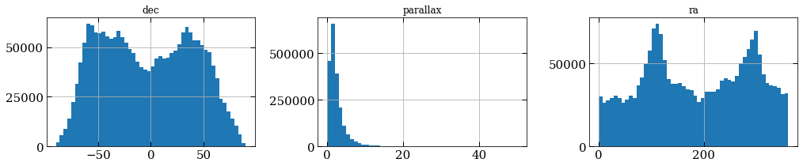


We could have also made these two cuts to our data at the same time


```python
dat  = pd.read_hdf('alldata.hdf',columns=['ra','ra_error','dec','dec_error','parallax','parallax_error']).reset_index()
bad_indices = dat.parallax < 0   # Negative parallax indices
bad_indices = bad_indices | (1./dat.parallax < .02)  # OR operation with distances less than 30 pc
dat = dat.drop(dat[bad_indices].index)


print('{:d} rows'.format(len(dat)))
print('{:.1f} MB'.format(dat.memory_usage(index=True,deep=True).sum()/1e6))
fig,axes = plt.subplots(1,3,figsize=(17,3))
dat.hist(['ra','dec','parallax'],ax=axes,xlabelsize=15,ylabelsize=15,bins=50);
```

    2025681 rows
    129.6 MB


## Finding some known clusters

Now that we have our data, let's find some clusters! Our procedure will be,
* Input the (ra,dec,distance) position of a known star cluster.
* Find the Gaia data within a few degrees of that.
* Use a clustering algorithm to find the cluster (and any other clusters) in that field.

To save some time, I've coded up a Python class to hold all of the useful information and methods for a known star cluster. You should take some time to get a sense for how the class works. The class does several things:

* Given the (ra,dec,distance) position of the cluster, it uses Astropy to convert this into a Galactocentric position, which we'll use to compare stellar positions in real space, as opposed to just on the sky.

* The method `.lims()`, will calculate which of the given stars lies within a certain distance of the cluster center. You can see that it uses similar slicing operations that we saw earlier to return a subset of the data.

* The method `.plot_field()` will make a scatter plot of the local field on the sky.


```python
from astropy import units
import astropy.coordinates as coord
import numpy as np
class Cluster():
    def __init__(self,name,ra,dec,distance,size):
        """Initialize a cluster with the (ra,dec,distance) center and radial size."""
        self.name = name
        self.distance = distance
        self.coord = coord.SkyCoord(ra=[ra],dec=[dec],distance=[distance]*units.kpc)
        self.pos = (self.coord.ra[0]/units.deg,self.coord.dec[0]/units.deg)
        self.posg = self.coord.transform_to(coord.Galactocentric)
        self.posg = (self.posg.x[0]/units.kpc, self.posg.y[0]/units.kpc,self.posg.z[0]/units.kpc)
        self.size = size
        self.sizeg = np.deg2rad(self.size)*self.coord.distance[0]/units.kpc

    def lims(self,dat,nrad=5,sphere=True):
        if sphere:

            ind = (abs(dat.ra-self.pos[0])<self.size*nrad)&(abs(dat.dec - self.pos[1])<self.size*nrad)
            ind_dist = abs(1./dat.parallax * (1 + dat.parallax_error/dat.parallax) - self.distance) < .5*self.distance
            ind_dist |= ( abs(1./dat.parallax * (1 - dat.parallax_error/dat.parallax) - self.distance) < .5*self.distance)
            ind &= ind_dist
            print('{:d} objects in {:d} degree radius'.format(len(dat.ra[ind]),nrad))
        else:
            ind = (abs(dat.x - self.posg[0])<self.sizeg*nrad)&(abs(dat.y - self.posg[1])<self.sizeg*nrad)&(abs(dat.z - self.posg[2])<self.sizeg*nrad)
            print('{:d} objects in projected {:.1f} pc radius'.format(len(dat.ra[ind]),self.sizeg*nrad))
        return ind
    def plot_field(self,dat,nrad=5,sphere=True):
        ind = self.lims(dat,nrad,sphere)
        fig = plt.figure(figsize=(8,6))
        ax = fig.add_subplot(111)
        ax.tick_params(labelsize=15)
        img=ax.scatter(dat.ra[ind],dat.dec[ind],c=1e3/dat.parallax[ind],s=6,cmap='jet')
        ax.set_title('{}  D={:d} pc'.format(self.name,int(self.distance*1e3)),fontsize=20)
        ax.plot(self.pos[0],self.pos[1],'k*',ms=20)
        x = np.linspace(0,2*np.pi,100)
        ax.plot(self.pos[0] + self.size*np.cos(x),self.pos[1] + self.size* np.sin(x),'--k')
        cbar = plt.colorbar(img)
        cbar.ax.set_ylabel('Distance [pc]',fontsize=20)
        cbar.ax.tick_params(labelsize=15)
        ax.set_xlabel('Right Ascension [degrees]',fontsize=20)
        ax.set_ylabel('Declination [degrees]',fontsize=20)
```

Let's take the <a href="https://en.wikipedia.org/wiki/Hyades_(star_cluster)">Hyades</a> cluster is our first example. The Hyades is roughly located at (ra,dec,distance) = (4h27m,+15d52m,47 pc), and is ~330 arcmin in size.

Load in the Hyades and show the star field around its position on the sky.


```python
hyades=Cluster('Hyades','4h27m','+15d52m',.047,330./60.)
hyades.plot_field(dat)
```

    1277 objects in 5 degree radius


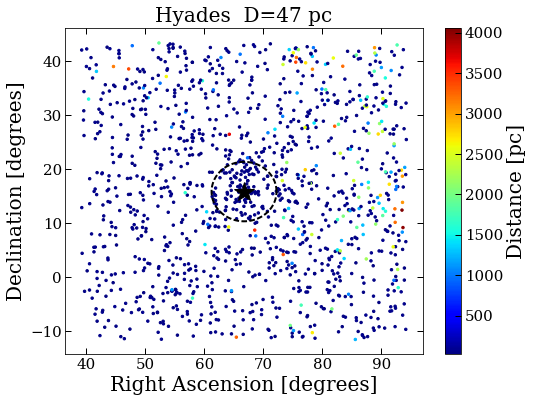


Let's also load in the <a href="https://en.wikipedia.org/wiki/Pleiades">Pleiades</a>, <a href="https://en.wikipedia.org/wiki/Beehive_Cluster">Beehive</a>, <a href="https://en.wikipedia.org/wiki/Coma_Star_Cluster">Coma</a>, <a href="https://en.wikipedia.org/wiki/Alpha_Persei_Cluster">Alpha Persius</a> clusters,


```python
pleiades = Cluster('Pleiades','3h47m','+24d07m',.1362,110./60)
pleiades.plot_field(dat)
beehive = Cluster('Beehive','08h40.4m','19d59m',.177,95./60)
beehive.plot_field(dat)
coma = Cluster('Coma','12h22.5m','+25d51m',.086,7.5)
coma.plot_field(dat)
alphaper = Cluster('Alpha Persius','03h26.9m','+49d07m', .5*(.171+.200),185./60.)
alphaper.plot_field(dat)
```

    1946 objects in 5 degree radius
    2591 objects in 5 degree radius
    8184 objects in 5 degree radius
    8484 objects in 5 degree radius


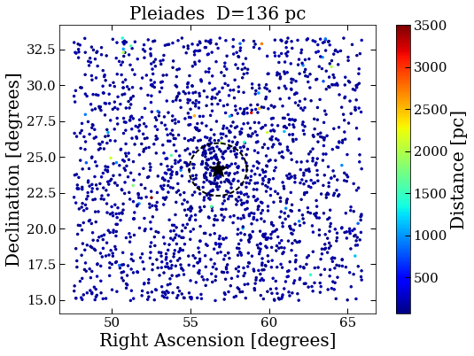


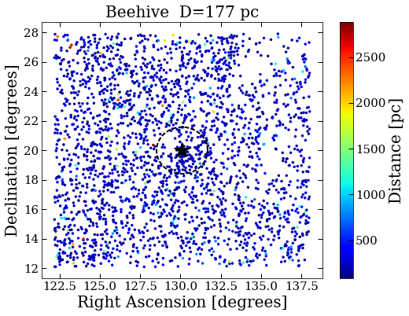


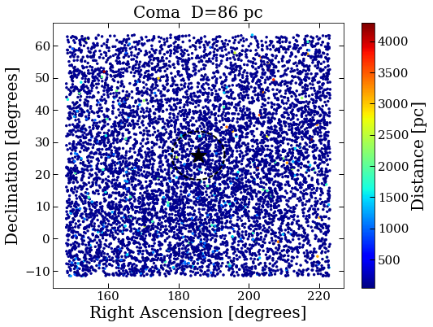


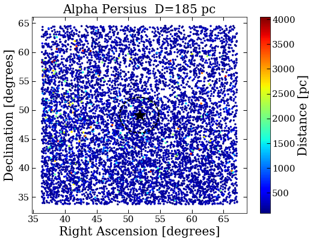


## The Algorithm
Now that we have our star fields, let's figure out how we're going deterime which stars are a part of a cluster. The basic idea will be to identify regions which are more dense (in phase space) than their surroundings. There are many different algorithms for doing this, and each has their advantages and weaknesses.

Grouping similar things together is a common task in [machine learning](https://en.wikipedia.org/wiki/Cluster_analysis), and we'll borrow the tools and techniques from that field for our analysis. In particular, we'll be using the popular [DBSCAN](https://en.wikipedia.org/wiki/DBSCAN) algorithm.

DBSCAN works as follows. For every point in your dataset DBSCAN will search in a radius of $\epsilon$ for $N$ points. If there are at least $N$ points within this distance, then these points start a cluster. DBSCAN then goes through all of the other data points and looks within a ball of radius $\epsilon$ for $N$ more points. If any of these regions overlap, the clusters are merged. DBSCAN continues to do this until all points are either a part of a cluster, or are a part of the background noise. Here's a simple schematic of how this looks for $N=4$,


Luckily for us, the Python library [Scikit-learn](http://scikit-learn.org/stable/) has implemented DBSCAN in its [clustering](http://scikit-learn.org/stable/modules/clustering.html#clustering) module. You can read the documentation for how to use DBSCAN [here](http://scikit-learn.org/stable/modules/generated/sklearn.cluster.DBSCAN.html#sklearn.cluster.DBSCAN).

I've written some wrapper functions (modified from the DBSCAN example) to find all of the clusters with `min_samples` in a radius of `eps`, and to plot the results in several differnt ways.


```python
from astropy.coordinates import Distance
from sklearn.neighbors import DistanceMetric
from sklearn.cluster import DBSCAN
def get_clusters(pos,eps=.005,min_samples=20,sphere=True):   
    if sphere:
        print('Requiring that there are {:d} neighbors in a {:.1f} degree radius '.format(min_samples, np.rad2deg(eps)))
        print('Using haversine 2D distance on sky')
        dist= DistanceMetric.get_metric('haversine').pairwise(pos[:,:2])
    else:
        print('Requiring that there are {:d} neighbors in a {:.1f} pc radius '.format(min_samples, eps*1e3))
        print('Using Euclidean 3D distance')
        dist= DistanceMetric.get_metric('euclidean').pairwise(pos)
    db = DBSCAN(eps=eps, min_samples=min_samples,metric='precomputed').fit(dist)
    core_samples_mask = np.zeros_like(db.labels_, dtype=bool)
    core_samples_mask[db.core_sample_indices_] = True
    labels = db.labels_

    # Number of clusters in labels, ignoring noise if present.
    n_clusters_ = len(set(labels)) - (1 if -1 in labels else 0)
    return labels,core_samples_mask
def cluster_distances(pos,labels,core_samples_mask,known_clusters=None,sphere=True,top='all',ax=None,fig=None):
    n_clusters_ = len(set(labels)) - (1 if -1 in labels else 0)
    unique_labels = np.unique(labels)
    if ax is None:
        fig,ax = plt.subplots(figsize=(8,6))
    if not sphere:
        print('Please use the ra/dec coordinates')
        return
    counts = np.array([len(labels[labels == k]) for k in unique_labels])
    cinds = np.argsort(counts)[::-1]    
    unique_labels = unique_labels[cinds]
    if top == 'all':
        top = len(unique_labels+1)
    else:
        top += 1
    colors = plt.cm.Vega10(np.linspace(0, 1, len(unique_labels[:top])))
    for k, col in zip(unique_labels[:top], colors):
        if k != -1:
            class_member_mask = (labels == k)
            d = pos[class_member_mask &core_samples_mask,-1]
            nc = len(d)
            if nc>1:
                lbl='{:d} Members'.format(nc)
            else:
                lbl = '1 Member'
            ax.hist(d*1e3,color=col,histtype='step',lw=3,label=lbl )
            ax.axvline(d.mean()*1e3,c=col,ls='--',lw=3)
    ax.set_xlabel('D [pc]',fontsize=20)
    ax.set_ylabel('Counts',fontsize=20)
    ax.tick_params(labelsize=15)
    ax.legend(loc='best',fontsize=15)
    if known_clusters is not None:
        for cluster in known_clusters:
            ax.axvline(cluster.distance*1e3,c='k',ls='--')
def plot_clusters(pos,labels, core_samples_mask,known_clusters=None,sphere=True,top='all',ax=None,fig=None):
    n_clusters_ = len(set(labels)) - (1 if -1 in labels else 0)
    unique_labels = np.unique(labels)
    if ax is None:
        fig,ax = plt.subplots(figsize=(8,8))

    counts = np.array([len(labels[labels == k]) for k in unique_labels])
    cinds = np.argsort(counts)[::-1]    
    unique_labels = unique_labels[cinds]
    if top == 'all':
        top = len(unique_labels+1)
    else:
        top += 1
    colors = plt.cm.Vega10(np.linspace(0, 1, len(unique_labels[:top])))
    for k, col in zip(unique_labels[:top], colors):
        alpha = 1
        if k == -1:
            # Black used for noise.
            col = 'k'
            alpha = .2

        class_member_mask = (labels == k)

        xy = pos[class_member_mask & core_samples_mask,:2]

        if sphere:
            xy = np.rad2deg(xy)
        ax.scatter(xy[:, 0], xy[:, 1], c=col, s=20,alpha=alpha)

        xy = pos[class_member_mask & ~core_samples_mask,:2]

        if sphere:
            xy = np.rad2deg(xy)
        ax.scatter(xy[:, 0], xy[:, 1], c=col, s=2,alpha=alpha)
        if k != -1:
            ax.plot([xy[:,0].mean()],[xy[:,1].mean()],marker='+',c=col,ms=25,mew=5)
    ax.set_title('Estimated number of clusters: {:d}'.format(n_clusters_),fontsize=20)

    if known_clusters is not None:
        for cluster in known_clusters:
            x = np.linspace(0,2*np.pi,100)
            if sphere:
                ax.plot(cluster.pos[1] + cluster.size*np.cos(x) ,cluster.pos[0] + cluster.size*np.sin(x) ,'--k',lw=3)
                ax.plot([cluster.pos[1]],[cluster.pos[0]],'*',ms=12,c='k')
                ax.set_ylabel('Right Ascension [Degrees]',fontsize=20)
                ax.set_xlabel('Declination [Degrees]',fontsize=20)

            else:
                ax.plot(cluster.posg[0] + cluster.sizeg*np.cos(x) ,cluster.posg[1] + cluster.sizeg*np.sin(x) ,'--k',lw=3)
                ax.plot([cluster.posg[0]],[cluster.posg[1]],'*',ms=12,c='k')
                ax.set_xlim(cluster.posg[0]-cluster.sizeg*5,cluster.posg[0]+cluster.sizeg*5)
                ax.set_ylim(cluster.posg[1]-cluster.sizeg*5,cluster.posg[1]+cluster.sizeg*5)
                ax.set_ylabel('X [kpc]',fontsize=20)
                ax.set_xlabel('Y [kpc]',fontsize=20)
    ax.minorticks_on()

    ax.tick_params(labelsize=15)

    fig.tight_layout()
def plot_clusters3d(pos,labels, core_samples_mask,known_clusters=None,sphere=True,top='all',ax=None,fig=None):
    from mpl_toolkits.mplot3d import Axes3D
    n_clusters_ = len(set(labels)) - (1 if -1 in labels else 0)
    unique_labels = np.unique(labels)
    if ax is None:
        fig = plt.figure(figsize=(8,8))
        ax = fig.add_subplot(111,projection='3d')
    counts = np.array([len(labels[labels == k]) for k in unique_labels])
    cinds = np.argsort(counts)[::-1]    
    unique_labels = unique_labels[cinds]
    if top == 'all':
        top = len(unique_labels+1)
    else:
        top += 1
    colors = plt.cm.Vega10(np.linspace(0, 1, len(unique_labels[:top])))
    for k, col in zip(unique_labels[:top], colors):
        alpha = 1
        if k != -1:
            class_member_mask = (labels == k)

            xyz = pos[class_member_mask & core_samples_mask,:]

            if sphere:
                xyz[:,:2] = np.rad2deg(xyz[:,:2])
            ax.scatter(xyz[:, 0], xyz[:, 1],xyz[:,2], c=col, s=50,alpha=alpha)

            xyz = pos[class_member_mask & ~core_samples_mask,:]

            if sphere:
                xyz[:,:2] = np.rad2deg(xyz[:,:2])
            ax.scatter(xyz[:, 0], xyz[:, 1], xyz[:,2],c=col, s=2,alpha=alpha)
            if k != -1:
                ax.plot([xyz[:,0].mean()],[xyz[:,1].mean()],[xyz[:,2].mean()],marker='+',ms=20,mew=8,c=col)
    ax.set_title('Estimated number of clusters: {:d}'.format(n_clusters_),fontsize=20)
    ax.set_xlabel('X [kpc]',fontsize=20,labelpad=20)
    ax.set_ylabel('Y [kpc]',fontsize=20,labelpad=20)
    ax.set_zlabel('Z [kpc]',fontsize=20,labelpad=20)

    ax.minorticks_on()

    ax.tick_params(labelsize=15)

    fig.tight_layout()    
def prepare_coords(dat,cluster,sphere=True,nrad=5):
    ind = cluster.lims(dat,nrad=nrad)
    pos = coord.SkyCoord(ra=np.array(dat.ra[ind])*units.degree,dec=np.array(dat.dec[ind])*units.degree,distance=np.array(1./dat.parallax[ind])*units.kpc,frame='icrs')
    if sphere:
        return np.vstack((np.deg2rad(np.array(pos.dec/units.deg)), np.deg2rad(np.array(pos.ra/units.deg)),np.array(pos.distance/units.kpc))).T
    else:
        pos = pos.transform_to(coord.Galactocentric)
        return np.vstack((np.array(pos.x/units.kpc), np.array(pos.y/units.kpc),np.array(pos.z/units.kpc))).T
def find_cluster(cluster,dat,eps=.005,min_samples=5,nrad=5,top=3):
    pos = prepare_coords(dat,cluster,nrad=nrad,sphere=False)
    labels, core_mask = get_clusters(pos,
                                     eps=eps,min_samples=min_samples,sphere=False)
    fig,axes = plt.subplots(1,2,figsize=(12,6))
    pos = prepare_coords(dat,cluster,nrad=nrad)
    plot_clusters(pos,labels,
                  core_mask,known_clusters=[cluster],sphere=True,ax=axes[0],fig=fig,top=top)
    cluster_distances(pos,labels,
                      core_mask,known_clusters=[cluster],sphere=True,ax=axes[1],fig=fig,top=top)
    fig.tight_layout()
def find_cluster3d(cluster,dat,eps=.005,min_samples=5,nrad=5,top=3):
    pos = prepare_coords(dat,cluster,nrad=nrad,sphere=False)
    labels, core_mask = get_clusters(pos,
                                     eps=eps,min_samples=min_samples,sphere=False)

    plot_clusters3d(pos,labels,
                  core_mask,known_clusters=[cluster],sphere=False,top=top)

```

To use these you just need to call the `find_cluster(cluster,dat,eps,min_samples)` function, and specify `eps` and `min_samples`. The default values for these are 5 stars within 5 pc, but you should adjust them to see how they affect the final results.

To start, let's look at the Hyades.


```python
%matplotlib inline
find_cluster(hyades,dat,eps=.003) # 5 stars within 3 pc
```

    1277 objects in 5 degree radius
    Requiring that there are 5 neighbors in a 3.0 pc radius
    Using Euclidean 3D distance
    1277 objects in 5 degree radius


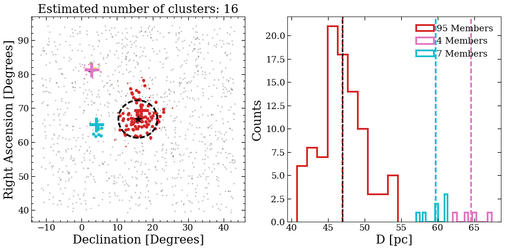


DBSCAN found 9 clusters, and we're showing just the three largest ones. Each cluster has an associated color and is shown on the sky in the left plot. The center of mass is shown with a cross. The right plot shows the distribution of distances for each cluster, with the average distance shown by the dashed vertical line.  Stars that are not a part of a cluster are shown in grey.

We can see that the largest cluster has 66 members and is roughly centered on the sky near the known location of the Hyades. Looking at the distances, we see that the distrubtion is centered close to the Hyades distance, and has a ~5 pc spread. The tidal radius of the Hyades is roughly ~10 pc, so these stars may actually be correctly classified. Note that the other clusers have < 5 members and are probably not signficant.

We can also use matplotlib's 3D plotting cababilities to see the cluster in 3D. For this we'll use the `%matplotlib notebook` magic to be able to manipulate the image.


```python
%matplotlib notebook
# If the notebook interace doesn't show up, you made need to restart the kernel and run this cell
find_cluster3d(hyades,dat,eps=.003)
```

    1277 objects in 5 degree radius
    Requiring that there are 5 neighbors in a 3.0 pc radius
    Using Euclidean 3D distance


Next we'll do the Pleiades,


```python
%matplotlib inline
find_cluster(pleiades,dat,eps=.0035)
```

    1946 objects in 5 degree radius
    Requiring that there are 5 neighbors in a 3.5 pc radius
    Using Euclidean 3D distance
    1946 objects in 5 degree radius


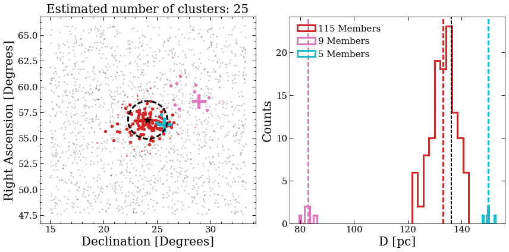


```python
%matplotlib notebook
find_cluster3d(pleiades,dat,eps=.0035)
```

    1946 objects in 5 degree radius
    Requiring that there are 5 neighbors in a 3.5 pc radius
    Using Euclidean 3D distance


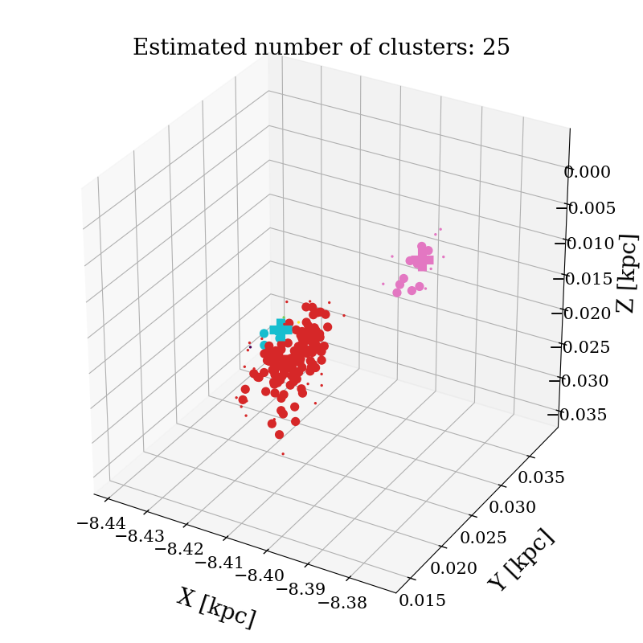


## More clusters

Try different values of `eps` and `min_samples` for the Hyades, Pleiades, and the other clusters below, to see how accurate you can get. Here are some questions to think about:
* Is there a sweet spot that works well for all of the clusters?
* Or do you have to finely tune the parameters each time?
* Is there a quantitative way to find the best `eps` and `min_samples`?
* How would you incorporate the positional uncertainties for each star in the clustering analysis?
* Can you search through the entire dataset to find new clusters?


```python
alphaper = Cluster('Alpha Persius','03h26.9m','+49d07m', .5*(.171+.200),185./60.)
coma = Cluster('Coma','12h22.5m','+25d51m',.086,7.5)
IC2391 = Cluster('IC 2391','08h40.6m','−53d02m',.175,50./60)
IC2602 = Cluster('IC 2602','10h42m57.5s','−64d23m39s',.167,50./60)
```


```python

```
